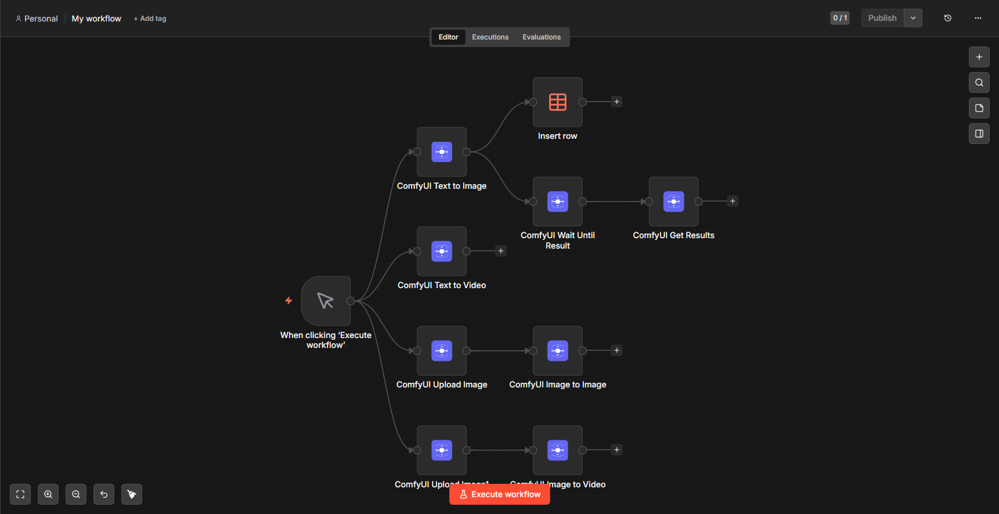
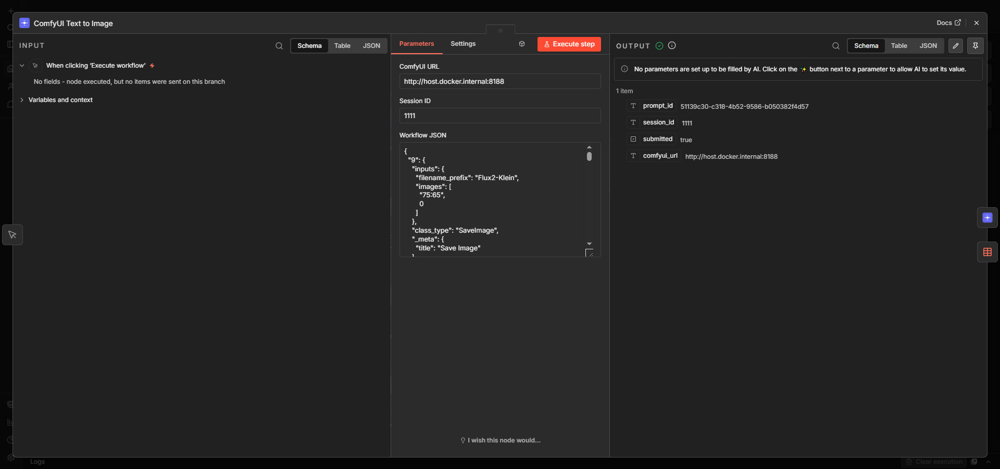
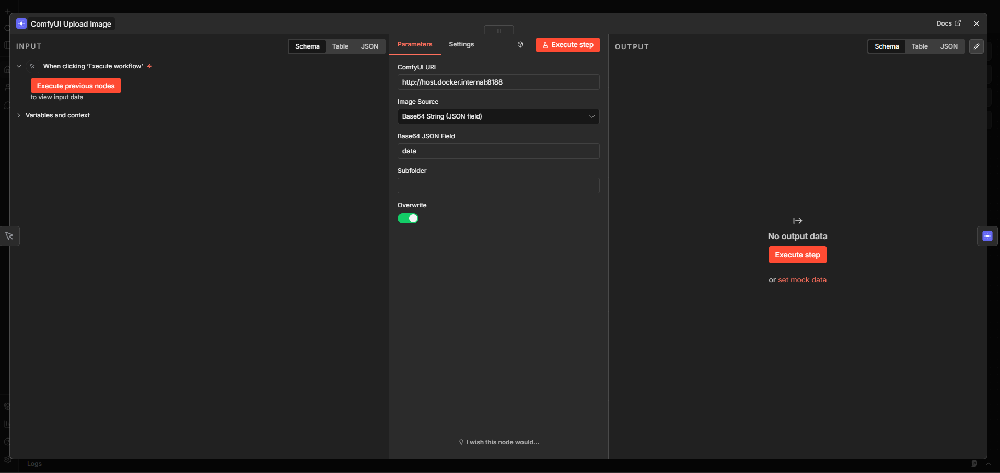
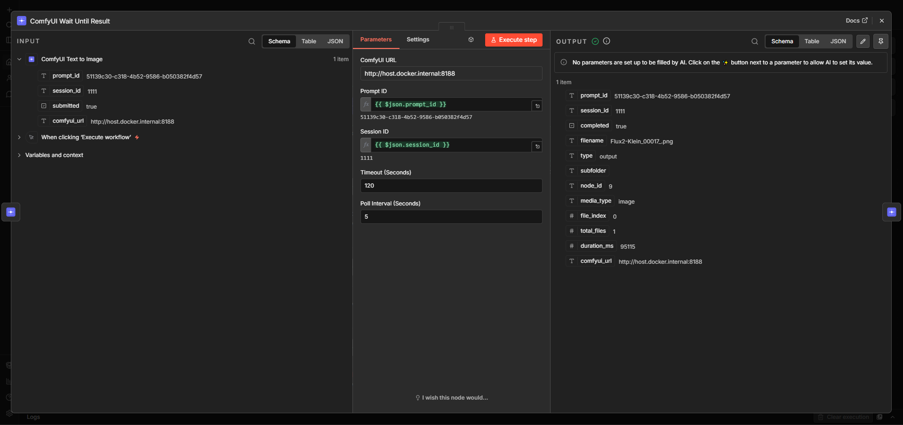
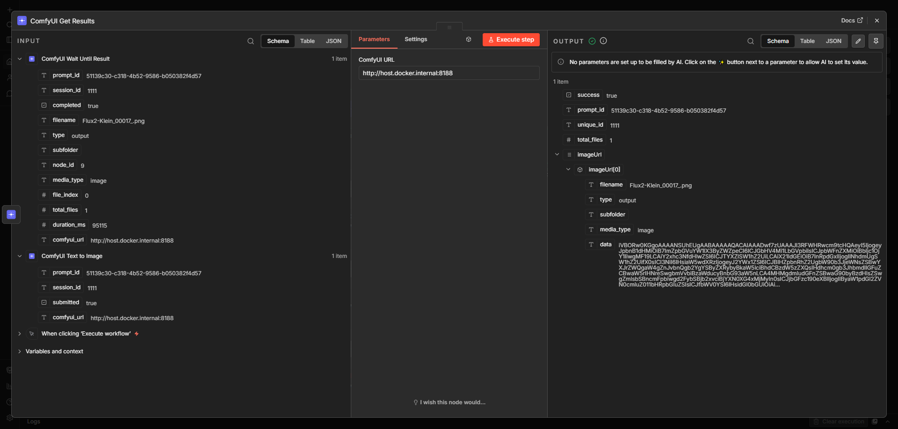
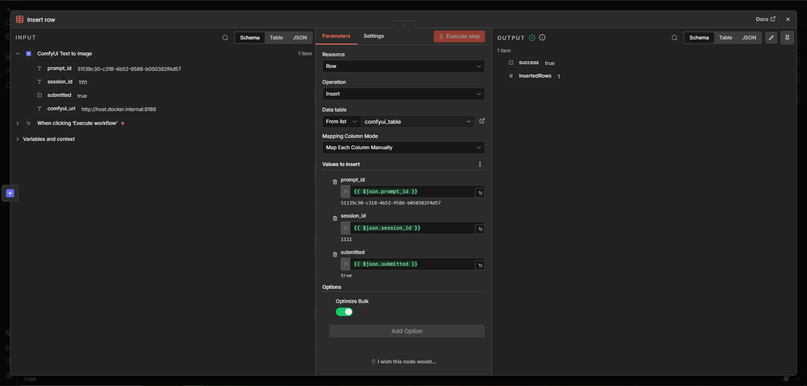

# n8n-nodes-comfyui-toolkit

[](https://www.npmjs.com/package/n8n-nodes-comfyui-toolkit)
[](https://www.npmjs.com/package/n8n-nodes-comfyui-toolkit)
[](https://github.com/federal1789/n8n-nodes-comfyui-toolkit/actions/workflows/ci.yml)
[](LICENSE)
[](https://www.npmjs.com/package/n8n-nodes-comfyui-toolkit)

Connect [ComfyUI](https://github.com/comfyanonymous/ComfyUI) to your n8n workflows. Generate images and videos, upload reference images, poll for results, and download outputs — all without leaving n8n.



---

## Why this toolkit?

The existing ComfyUI node for n8n blocks execution until generation finishes. Under concurrent load this means every pending request holds an n8n execution in memory.

This toolkit decouples submission from waiting:

| | This toolkit | Other nodes |
|---|---|---|
| **Submission** | Returns `prompt_id` immediately, n8n is free | Blocks until generation completes |
| **Concurrency** | Scales to any number of parallel jobs | Each job holds an n8n execution in memory |
| **Chat support** | Session ID maps jobs to conversations | No session tracking |
| **Workflow support** | Any ComfyUI workflow, paste API JSON directly | Often model-specific |

---

## Installation

### Via n8n Community Nodes UI (recommended)

1. Open n8n → **Settings → Community Nodes**
2. Click **Install** and enter: `n8n-nodes-comfyui-toolkit`
3. Confirm and restart n8n when prompted

### Via Docker

```bash
docker exec -it n8n sh -c "cd /home/node/.n8n/nodes && npm install n8n-nodes-comfyui-toolkit"
docker restart n8n
```

### Via npm (self-hosted without Docker)

```bash
cd ~/.n8n/nodes
npm install n8n-nodes-comfyui-toolkit
```

---

## Typical Workflows

**Text to Image**
```
[Trigger] ──► [Text to Image] ──► [Wait Until Result] ──► [Get Results]
```

**Image to Image / Image to Video**
```
[Trigger] ──► [Upload Image] ──► [Image to Image] ──► [Wait Until Result] ──► [Get Results]
```

---

## Nodes

### Generation Nodes

Submit a workflow to ComfyUI and return `prompt_id` immediately.



| Node | Description |
|------|-------------|
| **ComfyUI Text to Image** | Submits a text-to-image workflow |
| **ComfyUI Image to Image** | Submits an image-to-image workflow |
| **ComfyUI Text to Video** | Submits a text-to-video workflow |
| **ComfyUI Image to Video** | Submits an image-to-video workflow |

**Parameters**

| Parameter | Type | Description |
|-----------|------|-------------|
| ComfyUI URL | string | Base URL of your ComfyUI instance |
| Session ID | string | Identifier to correlate this job with a conversation or request |
| Workflow JSON | string | ComfyUI API-format workflow. Accepts both `{"prompt":{…}}` and the bare `{…}` prompt object. n8n expressions supported. |

**Output:** `prompt_id`, `session_id`, `submitted: true`, `comfyui_url`

---

### ComfyUI Upload Image

Upload a reference image to ComfyUI before running an img2img or img2video workflow.



| Parameter | Type | Description |
|-----------|------|-------------|
| ComfyUI URL | string | Base URL of your ComfyUI instance (e.g. `http://localhost:8188`) |
| Image Source | options | `Binary Field` — from an n8n binary property; `Base64 String` — from a JSON field |
| Binary Property | string | Binary property name (when source = Binary Field) |
| Base64 JSON Field | string | Dot-separated JSON path to the base64 string (when source = Base64 String) |
| Subfolder | string | Optional subfolder inside ComfyUI's `input/` directory |
| Overwrite | boolean | Overwrite an existing file with the same name |

**Output:** all input fields plus `filename`, `subfolder`, `type`, `comfyui_url`

---

### ComfyUI Wait Until Result

Poll ComfyUI until the job completes. Run this whenever you need the result — not necessarily right after submission.



| Parameter | Type | Default | Description |
|-----------|------|---------|-------------|
| ComfyUI URL | string | `http://host.docker.internal:8188` | Base URL |
| Prompt ID | string | `={{ $json.prompt_id }}` | `prompt_id` from an upstream generation node |
| Session ID | string | `={{ $json.session_id }}` | Passed through to output |
| Timeout (Seconds) | number | 120 | Throws if the job does not complete in time |
| Poll Interval (Seconds) | number | 5 | How often to check ComfyUI's `/history` endpoint |

**Output (one item per file):** `filename`, `type`, `subfolder`, `media_type`, `node_id`, `file_index`, `total_files`, `duration_ms`, `prompt_id`, `session_id`, `completed: true`, `comfyui_url`

> **Note:** ComfyUI deduplicates identical workflows with the same seed. If a job completes in 0.00 s, this node throws immediately with a descriptive error. Use a random seed in your workflow to prevent deduplication.

---

### ComfyUI Get Results

Download all generated files and return them as base64-encoded data.



| Parameter | Type | Description |
|-----------|------|-------------|
| ComfyUI URL | string | Base URL of your ComfyUI instance |

Accepts all items output by **Wait Until Result** and aggregates them into a single output item.

**Output:** `success`, `prompt_id`, `unique_id`, `total_files`, `imageUrl[]`

Each entry in `imageUrl`: `filename`, `type`, `subfolder`, `media_type`, `data` (base64)

---

### Session ID — Prompt ID Mapping

Use `session_id` to correlate a ComfyUI job with a chat session, user ID, or any external identifier. It flows through every node and appears in the final output.



---

## Prerequisites

- **n8n** ≥ 1.0.0 (self-hosted)
- **ComfyUI** running and reachable from your n8n instance
- A ComfyUI workflow exported in **API format**

> To export: enable **Dev Mode** in ComfyUI settings (gear icon → Enable Dev Mode Options), then use **Save (API Format)**.

---

## Troubleshooting

<details>
<summary><strong>Node not appearing in n8n after installation</strong></summary>

- Restart n8n after installing the package.
- Verify the package is listed under Settings → Community Nodes.

</details>

<details>
<summary><strong>Connection refused / ECONNREFUSED</strong></summary>

- If n8n runs in Docker, use `http://host.docker.internal:8188` instead of `http://localhost:8188`.
- Confirm ComfyUI is reachable: `curl http://host.docker.internal:8188/system_stats`

</details>

<details>
<summary><strong>Wait Until Result times out</strong></summary>

- Increase the **Timeout** parameter.
- Check ComfyUI's queue — another job may be blocking yours.
- CPU-only generation can take several minutes; make sure a GPU is available.

</details>

<details>
<summary><strong>prompt_id not returned</strong></summary>

- Ensure your Workflow JSON is valid ComfyUI API format. Export it fresh using **Save (API Format)**.
- The node accepts both `{"prompt":{…}}` and the bare `{…}` prompt object.

</details>

<details>
<summary><strong>Permission denied error during installation (EACCES)</strong></summary>

```bash
docker exec -it --user root n8n chown -R node:node /home/node/.n8n/
docker restart n8n
```

</details>

---

## Development

```bash
git clone https://github.com/federal1789/n8n-nodes-comfyui-toolkit.git
cd n8n-nodes-comfyui-toolkit
npm install

npm run build   # compile TypeScript → dist/
npm test        # run Jest tests
npm run lint    # ESLint
```

---

## Contributing

Pull requests are welcome! See [CONTRIBUTING.md](CONTRIBUTING.md) for guidelines.

## Security

To report a vulnerability, see [SECURITY.md](SECURITY.md).

## License

MIT © [Ilker Umut](https://github.com/federal1789)
